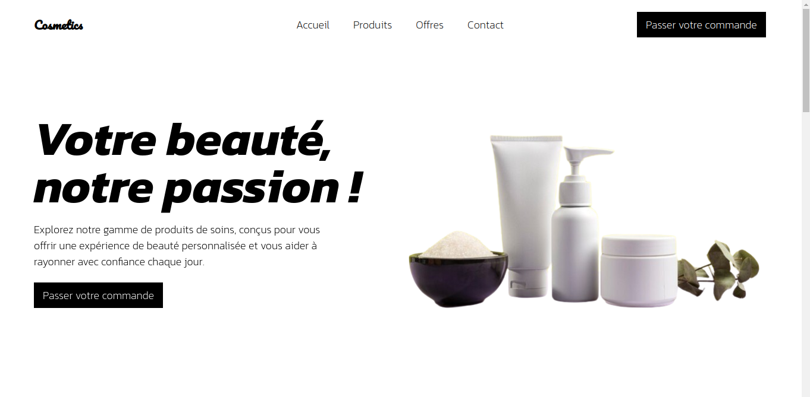
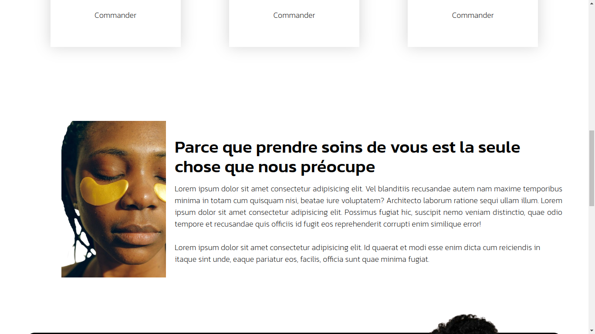

# Cosmetics - Landing Page

Bienvenue sur la **landing page** officielle de **Cosmetics**, votre destination pour des produits cosmétiques de haute qualité. Explorez notre gamme de soins pour la peau, maquillage, et bien plus encore, afin de sublimer votre beauté naturellement.

## Table des matières
- [Description](#description)
- [Installation](#installation)
- [Usage](#usage)
- [Contribuer](#contribuer)
- [Crédits](#crédits)



## Description

**Cosmetics** est une marque de cosmétiques innovants, conçus pour prendre soin de votre peau tout en sublimant votre beauté. Cette **landing page** a pour objectif de promouvoir nos produits phares, vous fournir des informations sur nos offres et vous permettre d'acheter directement en ligne.

La page est entièrement construite avec **HTML**, **CSS** et **JavaScript**, garantissant une expérience utilisateur fluide et optimisée pour tous les appareils.



**Caractéristiques principales** :
- **Produits cosmétiques** : Découvrez notre sélection de soins pour la peau, crèmes anti-âge, maquillage, et plus.
- **Design moderne** : Une interface épurée et facile à naviguer.
- **Optimisation mobile** : Navigation fluide sur tous vos appareils (ordinateur, tablette, smartphone).
- **Appels à l'action (CTA)** : Incitez vos visiteurs à acheter, s'inscrire à la newsletter ou suivre la marque sur les réseaux sociaux.

## Installation

### Prérequis
Aucun prérequis spécifique n'est nécessaire pour ce projet, car il fonctionne uniquement avec des fichiers **HTML**, **CSS** et **JavaScript**.

### Étapes d'installation

1. **Clonez le repository** :
   ```bash
   git clone https://github.com/godsky17/cosmetics-landing-page.git

## Usage

Une fois le fichier ouvert, vous pourrez voir le code de la landing page ainsi que des dossiers contenant le necessaire pour la page. La page comprend :

1. **index.html**
    Presente la structure de la page
2. **mailSucces**
    Presente la structure de la page de succes apres l'envoi d'un mail.
3. **Dossier assets**
    1. **dist**
        Dossier qui contient les fichier css et js
    2. **images**
        Dossier contenant les images utilisees pour le site


## Contribuer

Nous accueillons volontiers les contributions pour améliorer cette landing page. Voici comment vous pouvez contribuer :

1. Forkez le repository.
2. Clonez votre fork.
3. Créez une branche pour votre fonctionnalité ou correction :
bash
Copier le code
    ```bash
    git checkout -b feature/ajout-nouveau-produit
4. Apportez vos modifications.
5. Committez et poussez vos changements :
    Copier le code
    ```bash
    git add .
    git commit -m "Ajout d'un nouveau produit dans la galerie"
    git push origin feature/ajout-nouveau-produit
6. Ouvrez une Pull Request.
Assurez-vous que votre code respecte le format et les bonnes pratiques de l'application.

## Crédits

Ce projet a été conçu et développé par l'équipe de Cosmetics. Nous utilisons les technologies suivantes :

1. HTML pour la structure de la page.
2. CSS pour le stylisme et la mise en page.
3. JavaScript pour les interactions et la dynamique de la page.
### Autres suggestions :

- **Optimisation mobile** : Assurez-vous que votre landing page est bien responsive (adapte l'affichage sur mobile, tablette et desktop).
- **Performance** : Pour une meilleure expérience utilisateur, pensez à optimiser vos images et ressources (comme les icônes ou les scripts) pour garantir des temps de chargement rapides.
- **Accessibilité** : Utilisez des attributs `alt` pour les images, des couleurs contrastées et des titres (`<h1>`, `<h2>`) pour améliorer l'accessibilité de la page.

Avec ce `README.md`, toute personne souhaitant utiliser ou contribuer à votre projet saura exactement comment procéder. Bonne chance avec votre landing page Cosmetics !
